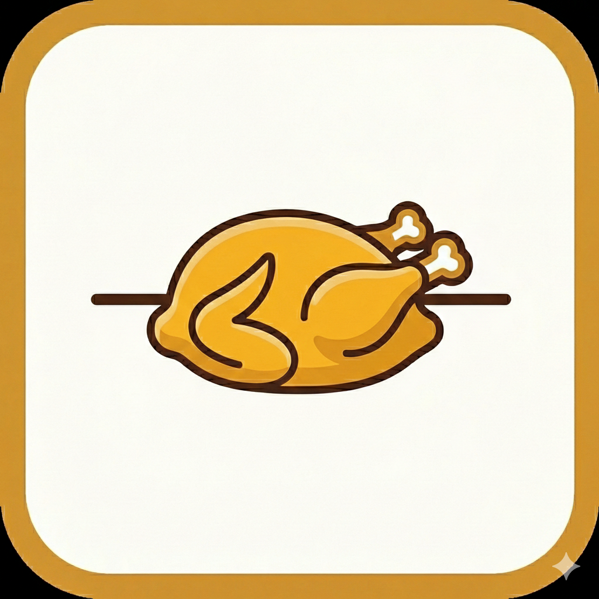

# Rotisserie

<p align="center">
  
</p>

<p align="center">
  <strong>Plan meals. Shop smarter. Cook. Repeat.</strong>
</p>

---

A family-focused meal planning and recipe management application that connects recipe management, meal planning, and grocery shopping into a unified workflow.

## Features

- **Recipe Management** - Store, organize, and access recipes with full CRUD operations
- **Cooking Mode** - Distraction-free, hands-free friendly interface for following recipes
- **Search & Filter** - Find recipes by name, tags, or ingredients

## Tech Stack

| Layer | Technology |
|-------|------------|
| Framework | React Router v7 (SSR) |
| Styling | Tailwind CSS + shadcn/ui |
| Database | PostgreSQL |
| Data Layer | Raw SQL (pg) + Zod validation |
| Testing | Playwright |

## Getting Started

```bash
# Install dependencies
npm install

# Start PostgreSQL
docker-compose up -d

# Run migrations
dbmate up

# Start dev server
npm run dev
```

## Development

```bash
npm run dev          # Start dev server (localhost:5173)
npm run build        # Production build
npm run typecheck    # TypeScript check
npm run test         # Run E2E tests
npm run test:ui      # Interactive test UI
```
